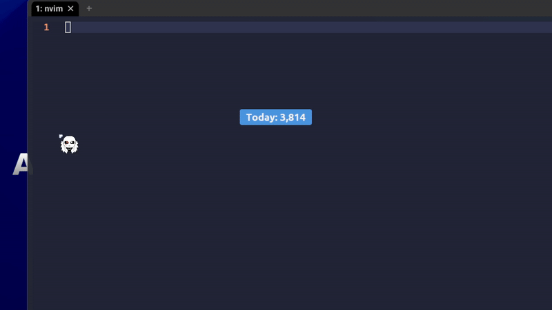
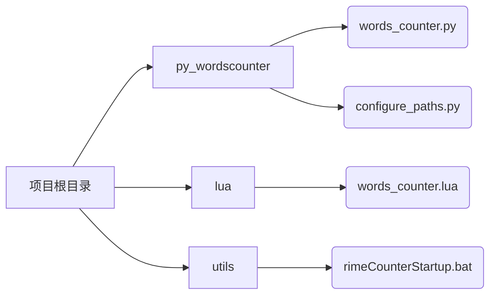
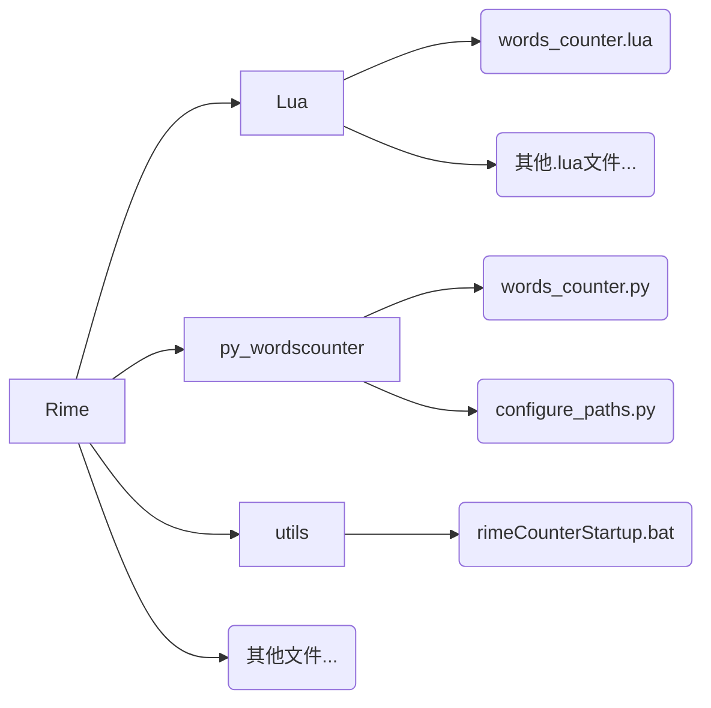

# Rime-words-counter 个人优化版本

### 重要声明
**本项目基于 hyuan42 的 Rime-words-counter，但原项目并未提供任何开源许可证。根据版权法，这意味着原代码默认“保留所有权利”。本仓库的发布是出于学习和技术交流目的进行的优化分享。请注意其中潜在的版权风险。本仓库中添加的 LICENSE 文件（MIT License）仅适用于本人原创和修改的部分代码，不适用于原作者的代码。如果原作者对此有任何异议，请联系我，我会立即删除本仓库。**

--------
## 鸣谢

该程序是基于[hyuan42](https://github.com/hyuan42)的[Rime-words-counter](https://github.com/hyuan42/Rime-words-counter)的个人深度定制版本，主要在性能和交互等方面做了一些优化，UI进行了一些个人的定制。

该项目只有Windows的字数版本，笔者没有Macbook，且不懂也从来没用过MacOS生态环境，故明文版本和MacOS均没有实现（~~没有明文版是因为我懒~~）。

实际上我两三个月前刚开始用Rime的时候就想要一个字数统计功能，奈何对Lua实在是不熟悉并且也缺乏动力和时间去学，一直没有去实现。后来偶然发现了这个插件，但是发现交互和性能上似乎还比较基础，所以借助Google Gemini对源代码（尤其是Python脚本）进行了优化。最开始我其实觉得用Python不是一个好的方向，所以尝试用AHK去实现GUI（不要问我为什么用的是AHK，被某些教程坑了导致的），但是后来才发现AHK不适合做轻量化GUI界面，尤其是包含与后端的IPC通信。而对于这种轻量化的、静默启动的工具，用C#和.NET写一个完整的Windows程序显然太大题小做（~~主要还是因为我不会~~），兜兜转转还是回到了hyuan42提供的代码进行优化，才诞生了现在这个版本。

本人实际上代码水平也有限，相当一部分的代码是用Google Gemini写的，可能有隐藏的bug或者疏漏，如果有大佬恳请指正。也请务必为原作者的项目点一个star！

----------

## 程序演示


## 优化、增加内容
### 性能瓶颈
#### 原因
原代码中性能瓶颈的根源主要是因为在`DataProcessor.process_incremental`方法中，每次words_counter.csv一有微小变动，都会触发一个读取JSON->更新内存->写入JSON的完整循环，文件I/O，尤其是磁盘写入是相对缓慢的操作，当输入法高频触发的时候，这个完整的循环就会成为瓶颈，导致延迟。
并且，悬浮窗`FloatingWindow`的`_schedule_update`方法使用`after(300, ...)`来定时轮询数据，而不是在数据变化时才更新，这造成了固定的300ms延迟，而且不够高效，还有可能引入潜在的性能开销（虽然可以微小到不计）。
#### 解决
引入内存缓存机制。`DataProcessor`不会每次都读写JSON文件，而是在内存中维护一份最新的字数统计数据`per_day`和`totals`。当`watchdog`检测到csv文件变化后，`DataProcessor`会快速读取.csv的增量部分，更新内存中的统计数据并且立即通过回调函数通知主UI程序更新。
更新完内存之后，启动一个大约3-5秒左右的计时器，如果计时器结束之前没有新的输入，再把内存中的数据写入到JSON当中；如果期间有新输入再重置计时器。这样可以把多次零碎的写入操作合并为一次，以此来降低I/O频率，同时保证数据最终会持久化，方便后续统计和查看。
### 外观
引入任意一个现代的Tkinter美化库即可，本仓库使用的是`ttkbootstrap`。
如果想使用另外的美化库，比如sun-valley-ttk-theme，请自行查找教程修改~~或者问AI~~。
### 右键菜单
取消了托盘图标，直接右键悬浮窗本体即可打开右键菜单。
### 热力图
可以根据年、月、周查看自己的输入热力图。
### 实时输入速度测试
右键菜单中增加了一个”切换速度显示“的选项，打开即可根据过去60s的输入进行大致的输入速度统计。单位为字/分。

--------

## 安装教程

本教程绝大部分来源于原作者的[教程](https://github.com/hyuan42/Rime-words-counter/blob/main/%E6%95%99%E7%A8%8B-%E6%93%8D%E4%BD%9C%E6%AD%A5%E9%AA%A4/Windows%E5%8D%95%E8%AE%BE%E5%A4%87%E4%BD%BF%E7%94%A8-%E5%B0%8F%E7%8B%BC%E6%AF%AB.md)，再次完整引用防止安装混乱。

### 准备环境
1. 确保你的Windows系统已经安装了Python环境，建议Python 3.8+。可以在CMD使用`python --version`或者直接输入`python`进行查看。（注：直接输入`python`后记得Ctrl+Z退出当前Python环境）。
2. 在CMD或者PowerShell等任意命令行环境内安装所有必要的依赖库：
```bash
pip install -r requirements.txt
```
### 准备文件
前往本仓库的 Release 页面下载最新的 .zip 压缩包，解压后得到三个文件夹：py_wordscounter/、lua/和utils/。文件结构应当是如图所示：

进入Rime用户文件夹（右下角Weasel小狼毫图标右键 - 用户文件夹，如果是默认路径安装，则路径应该会是这样的格式：
```
C:\Users\你的用户名\AppData\Roaming\Rime\
```
如果不是，则回忆安装Weasel的时候是否有选定自定义安装路径。总之要在用户文件夹里面。
将py_wordscounter文件夹原封不动地复制进去。倘若Rime\内已经有了一个lua/，则直接把words_counter.lua复制到lua/内；如果没有，则手动新建一个lua文件夹。复制好之后的文件结构应该会是这样：

### （可选）运行自动配置
~~如果你是一个忠实的手动路径配置者，不相信任何自动化的脚本认为这些都是资本家的阴谋，可以跳过这一步lmao~~
在Rime/py_wordscounter/或者任意你存放`configure_paths.py`的路径下进入CMD / PowerShell。
运行自动化脚本：
```bash
python configure_paths.py
```
脚本会自动推荐一个数据存放路径，可以直接按回车确认，或者输入你自己想要的路径，你看着来。

### 在Rime中启用
这一步对于程序能否生效至关重要。
首先确认你正在使用的Rime输入方案。按``Ctrl + ` ``来查看自己目前使用的输入方案。
以笔者为例，笔者使用的是雾凇拼音，查阅[官方](https://github.com/iDvel/rime-ice)GitHub页面可知，该输入方案对于Rime的读取使用的名字是rime_ice。则打开`rime_ice.schema.yaml`。如果你用的是其他方案，比如薄荷拼音（rime_mint），那么就是`rime_mint.schema.yaml`，以此类推。
打开文件之后，找到`engine:`下的`processors:`列表。在列表末尾添加一行` - lua_processor@*words_counter`，保存文件然后右键点击输入法图标，选择重新部署。
重新部署之后记得也要运行words_counter.py。


### （可选）开机静默自启动
如果想要让程序随着开机自启动，则先编辑`utils/rimeCounterStartup.bat`，将里面的路径改为你自己的Rime路径。更改保存之后，Win+R，输入`shell:startup`，直接将该.bat文件复制到`shell:startup`内即可。

------

## 自定义修改

#### 1. 修改悬浮窗动画
位置：`FloatingWindow`类中的`scramble_animation`方法。
当前实现的是数字扰动更替效果，如果你不喜欢，可以直接在 `update_count` 方法中，将对 `self.scramble_animation(count)` 的调用替换为一个简单的 `self.update_layout()`，即可变为无动画的瞬时更新。当然，你也可以在这里实现自己喜欢的任何动画效果，需要python编程知识~~或者去问ai~~。
#### 2. 修改悬浮窗外观
位置：`FloatingWindow`类中的`update_layout`方法
这个方法负责根据当前字数和速度动态计算悬浮窗的大小、颜色和布局。你可以在这里调节内边距`padding`，圆角半径`radius`，字体颜色等等。~~顶部的常量配置区也可以直接修改字体和字号~~目前有bug，字体无法更改。
#### 3. 修改热力图
位置：`HeatmapWindow`类
视图切换的逻辑由顶部的 `Radiobutton` 控制。三种视图（年、月、周）的绘制逻辑分别在 `draw_year_heatmap`、`draw_month_heatmap` 和 `draw_week_heatmap` 三个独立的方法中。你可以修改每种视图的颜色、布局或数据计算方式等。
#### 4. 修改右键菜单
位置：`FloatingWindow`类中的`_build_context_menu`方法。
可以在这里像操作普通的Tkinter菜单一样，随意增加(`.add_command`)、删除或菜单项及其对应的功能。

## 授权协议

本项目采用 [MIT License](./LICENSE) 。